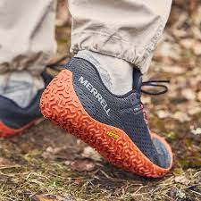

## Culture

Jeux-vidéos
- Voir ma [wishlist sur Steam](https://store.steampowered.com/wishlist/profiles/76561198025849848/#sort=order), y'a de tous les genres et pour tous les prix

Lecture
- [La révolution du potager](https://www.laplage.fr/produit/263/9782383380054/la-revolution-du-potager)

Jeux d'extérieur
- Jeu de Kubb, la pétanque viking 

## Vêtements et accessoires

- J'ai déjà un bon stock de vêtements, dont pas mal de **t-shirt**, mais il y en a [de très beaux sur Dephect](https://www.dephect.com/collections/t-shirts). Pour la taille, je fais du M - Prévoir un peu de temps pour la livraison. 
- Un **autre t-shirt**, fluo et un peu provocateur, [le t-shirt "Shlag à vélo"](https://www.shlaglab.com/product/t-shirt-shlag-a-velo-kien-tam)
- Mes chaussures minimalistes sont en train de rendre l'âme. J'ai repéré les **Merrell Vapor Glove 6 couleur Granite/Tangerine**. Elles sont stylées mais les stocks sont très limités. Je chausse du 42/43
  
   
- Je suis à la recherche d'un bon **pantalon de pluie** pour faire du vélo par tout temps. Celui que j'ai actuellement est trop serré et pas respirant : j'étouffe dedans. En cherchant qqchose de respirant et de facile à utiliser par dessus un pantalon, sans retirer les chaussures, j'ai trouvé le [Panti-Pluie de chez Rainette](https://rainette-shop.com/products/panti-pluie-pour-velo)
- Des **chaussettes fun** c'est toujours une bonne idée
- Des chaussures de vélo type "casual / urbain" compatible fixation SPD (VTT) pour aller au travail et faire de petites sorties. [Quoc semble faire de bons produits](https://quoc.cc/products/weekend-black-on-white?variant=39987127943191). Il y a aussi les **Adidas Velosamba** (mais je n'arrive pas à accéder à leur site pour vous donner un lien)

## Consommables 

En ma qualité d'être humain, j'aime manger. Je suis toujours un grand fan des nourritures suivantes, ça ne peut jamais rater :
- **olives, tapenade**
- **herbes de provence, basilic, piments, assaisonnements**
- **huile d'olive, vinaigre balsamique**
- **thé floraux ou agrumes, rooibos**
- **café en grain**
- **confiture**
- **gingembre**
- **biscuits apéritifs**

En ma qualité d'être humain, je dois malheureusement me laver. 
- Un **savon solide** qui sent bon c'est aussi une très bonne idée :)

## Outils

Mes habits s'abiment et mériteraient d'être réparés plutôt que jetés. J'ai déjà un peu de matériel de couture accumulé avec le temps, mais la boîte pour les ranger est trop petite. 
- J'ai besoin d'une **trousse de couture** !
- Et en vrai, je sais réparer mais c'est pas toujours très joli. Si vous avez des livres, conseils, outils, etc. auxquels je n'ai pas pensé, je suis preneur :)